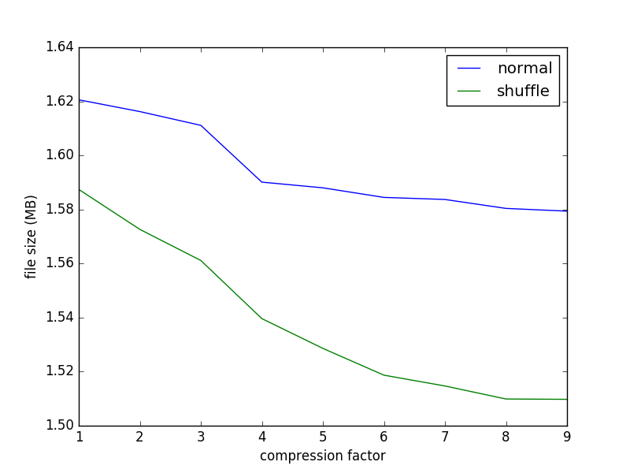

NETCDF exercise
###################

In this folder there are the results of the netcdf exercise. The first data used to do the exercise were taken from

.. code::
   
    http://test.opendap.org/opendap/data/nc/coads_climatology.nc

while the largest file used was taken from

.. code::
   
   http://thredds.daac.ornl.gov/thredds/dodsC/ornldaac/551/climate_1901_1998_PRE.nc4.html

The *script.sh* file shows the way in which are obtained the data for the plots. We compress the downloaded data with a growing compression factor (-d num flag) and then store the size of the compressed file in a correspondent file. The compression is also done with the shuffling of variables (-s flag) that tipically allow a better compression of the file.

We are interested in the size of the compressed files and in the time needed to decompress each file. It is trivial obtain the size of the compressed files. It can be obtained with the execution of the following command:

.. code::
   
   du -b name_file

which return the real size of the file in bytes (like in the output of ls -l). Instead, the measure of the time needed to decompress a file is a bit more complicate. In particular, for each file we measure for 10 times the time needed to perform the following command:

.. code::
   
   ncdump namefile > /dev/null

The redirection of the output to /dev/null allows to measure only the time to decompress the file without taking into account of the time needed to write the output into another file. The measures are done for both the shuffled and non-shuffled files.

RESULTS
========

The first obtained results are the ones referring to a file with original size of 3 MB. The following plot shows the size of the compresses file as a function of the compression factor:

As expected, the size of the shuffled compression is less the the other one.
